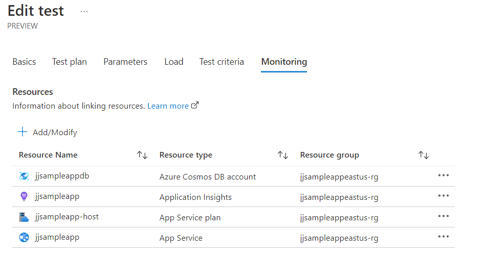

# Load Test Workshop Challenges

This is a short series of challanges that can be used in an interactive workshop to get hands on experience with Azure Load Testing.

It uses the sample application and sample load test script in this repository as a starting point.

The demo application is an web app hosted in Azure App Services with a Cosmos Database backend. The mission is to see if you can get 500 requests per second from this application without spending more money than is necessary on the Azure resources.

Later challenges are about adapting this to one of your own application or service.

# Challenge One - Create Load Test Resource

This may be done in the Azure portal or using automation. You could also try the [Quickstart](https://docs.microsoft.com/en-us/azure/load-testing/quickstart-create-and-run-load-test)


You need to consider the location of the load testing service with respect to the target system's location. Discuss why this may be important.

So, now we have a load testing service and we have tested it out against a URL, now let's deploy an application in the next challenge.

# Challenge Two - Create a Demo System Under Test

This challenge is about having our own application to test that we can later change to meet our performance requirements. 

## Installation

1. Clone this GitHub repository to your PC

```
git clone https://github.com/jometzg/nodejs-appsvc-cosmosdb-bottleneck.git
```

2. In your terminal window, log into Azure and set a subscription(subscription which would contain the webapp) :

        az login
        az account set -s mySubscriptionName

3. Clone the sample application's source repository. The sample application is a Node.js app consisting of an Azure App Service web component and a Cosmos DB database. The repo also contains a PowerShell script that deploys the sample app to your Azure subscription.

        git clone https://github.com/Azure-Samples/nodejs-appsvc-cosmosdb-bottleneck.git

4. Deploy the sample app using the PowerShell script. (Tip: macOS users can install PowerShell [here](https://docs.microsoft.com/en-us/powershell/scripting/install/installing-powershell-core-on-macos?view=powershell-7.1))

        cd SampleApp
        .\deploymentscript.ps1

5. You will be prompted to supply a unique application name and a location (default is `eastus`). A resource group for the resources would be created with the same name.
6. Once deployment is complete, browse to the running sample application with your browser.

        https://<app_name>.azurewebsites.net

## Discussion
Once deployed, discuss:
1. the application location
2. the application moving parts and how these may impact the performance of the application.

# Challenge Three - Run some load tests, checking results and changing scale to improve the application

In this challenge, we are going to use the JMeter JMX file from the cloned GitHub repo. This makes a series of requests against the application. So you load test will need to use this script for this challenge.

Follow the [steps](https://docs.microsoft.com/en-gb/azure/load-testing/how-to-create-and-run-load-test-with-jmeter-script#create-a-load-test) to configure a load test in the load test resource you created in challenge one.

You will need to upload the "SampleApp.JMX" file from the cloned repository


The SampleApp.JMX file is parameterised, so that the URL of the target application is not defined in the JMX file, but can be injected by JMeter at runtime. The parameter is called "webapp". It will need to be entered in the page shown below:


Make sure to also set the monitoring to point to your applications resources. This will allow Azure load testing to capture metrics from this application.



Once the configuration is complete. If the load test has not started, press "Run" and wait.


Look closely at the results from the run. Some discussion points:
1. What is the overall request rate
2. Is this what is needed
3. Are there any errors? If, so any ideas why?
4. Look at the Cosmos database metrics

The next step will be to tune the application and re-test to see if we can meet the original target request rate.


## Challenge Four - Tune the application and re-check

This may need several iterations.

What needed to change to achieve the desired request rate?

# Challenge Five - Generate a JMeter Dashboard of the results

The Azure Load Test service is currently in preview. The feature to generate JMeter dashboards has been disabled.

Work out how you may generate the JMeter dashboard yourself.

1. What do you need to do this?
2. Can it be done interactively or does it need some command-line tools?


# Challenge Six - Automate load testing in a GitHub Action

You will need to think about:
1. In which GitHub repository to run the action
2. when the action will run
3. How the action step is authenticated
4. How to drive parameters into the test
5. How to set success criteria
 
# Challenge Seven - Load test your own application's endpoint

This is where things get more interesting - to apply all of the above to an application of your own. What you will need to do is:
1. Create/amend a JMX file. 
2. Run load test interactively
3. Discuss what changes may be needed to the application or test to get better results
4. Automate in GitHub action - setting success criteria
